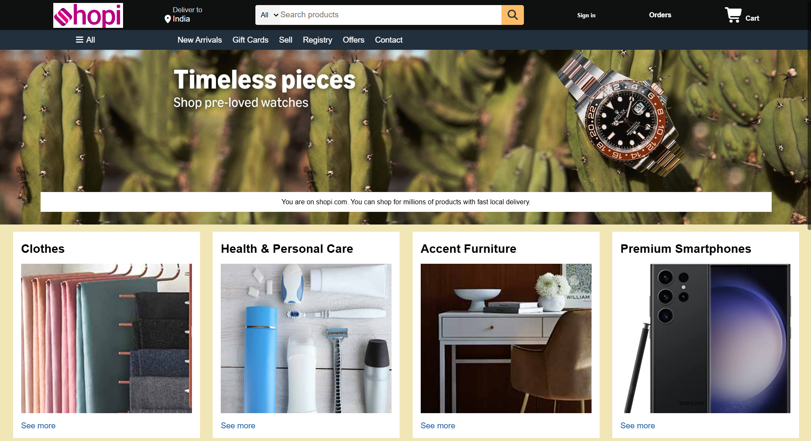

Educational frontend project. Not affiliated with Amazon.

A simple Amazon homepage clone built using **HTML and CSS**. The project focuses on recreating Amazon's homepage layout while practicing page structure, styling, Flexbox, and responsive design concepts. Smooth scrolling is implemented using Locomotive Scroll.


## 🚀 Live Demo
[Click here to view the project]()

## 📌 Features
- Amazon-style navbar
- Search bar
- Hero section
- Product category boxes
- Footer section
- Clean layout using HTML and CSS
- Smooth scrolling with Locomotive Scroll

## 🛠️ Tech Stack
- HTML5
- CSS3
- Font Awesome
- Locomotive Scroll

## 📷 Preview
<p align="center">
  
</p>
<p align="center">
  
</p>

## 📂 Project Structure
```bash
e-commerce-UI-clone/
│── index.html
│── style.css
│── script.js
│── README.md
│
├── assets/
│   │── logo.png
│   │── hero_section.jpg
│   │── box1_image.jpg
│   │── box2_image.jpg
│   │── box3_image.jpg
│   │── box4_image.jpg
│   │── box5_image.jpg
│   │── box6_image.jpg
│   │── box7_image.jpg
│   │── box8_image.jpg
│   │── Screenshot1.png
│   │── Screenshot2.png
```

## 📖 What I Learned
While building this project, I practiced:
- Structuring web pages with HTML
- Styling layouts using CSS
- Working with Flexbox
- Using background images effectively
- Creating reusable UI sections
- Integrating third-party libraries
- Deploying projects using GitHub Pages
- Using Git and GitHub for version control

## 📌 Future Improvements
- Make the website fully responsive
- Add interactive search functionality
- Add hover effects and animations
- Improve accessibility
- Recreate additional Amazon UI sections

## 👨‍💻 Author
krpranav7
